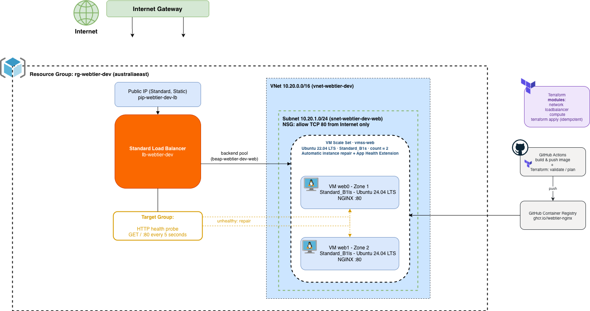

  

  

# Azure Self-Healing Web Tier

  

  

  

Auto-healing, N+1 web tier on Azure: a Linux Virtual Machine Scale Set (VMSS)

  

  

running NGINX, fronted by a Standard Load Balancer, with automatic instance

  

  

repair and autoscale-enforced minimum capacity so the loss of any single VM

  

  

is absorbed without downtime.

  

  

  

## Contents

  

  

  

- [Business Requirements](#business-requirements)

  

  

- [Solution Design / Architecture](#architecture)

  

  

- [Repository layout](#repository-layout)

  

  

- [Naming & tagging conventions](#naming--tagging-conventions)

  

  

- [Prerequisites](#prerequisites)

  

  

- [Remote state bootstrap](#remote-state-bootstrap)

  

  

- [Running plan / apply](#running-plan--apply)

  

  

- [How self-healing works](#how-self-healing-works)

  

  

- [Testing self-healing](#testing-self-healing)

  

  

- [Containerised variant (bonus)](#containerised-variant-bonus)

  

  

- [CI](#ci)

  

  

- [Cost estimate](#cost-estimate)

  

  

- [Assumptions](#assumptions)

  

  

  

## Business Requirements

  

Design and implement an infrastructure solution that delivers a highly available, self-healing web tier using Infrastructure as Code (IaC).

  

  

The solution should demonstrate modern cloud engineering practices, automation, scalability, and maintainability.

  

### Must Have

  

  

- The solution must have highly available web tier capable of withstanding the loss of a single compute instance without service interruption.

  

- The solution must automatically replace failed or terminated instances without manual intervention.

  

- The solution must distribute traffic across a minimum of two instances through a load-balancing mechanism.

  

- The solution must be provisioned entirely through Infrastructure as Code (IaC).

  

- The solution must support repeatable deployments.

  

- The solution must host and serve a static web page.

  

### Should Have

  

  

- The solution should have Terraform as the preferred IaC tool.

  

- The solution should have consistent naming, tagging, and modular design standards.

  

- The solution should have cost-effective, with an estimated operating cost of less than AUD $20 per month.

  

- The solution should have clear deployment and operational documentation.

  

  

### Could Have

  

  

- Deployed as a containerised application.

  

- Automatically pull and run container images during instance provisioning.

  

- Include a CI/CD pipeline to perform infrastructure validation, linting, and plan generation.

  

- Publish container images to a public container registry.

  

  

## Architecture



See `diagrams/architecture.drawio`

  

Considerations:

  

* Please see cost estimates below to understand Linux VMs over Windows VMs

  

## Repository layout

  

### ./root

  
-  `main.tf` - resource group + wires up the child modules

-  `variables.tf` - input variables (vm_size, instance_count, admin_ssh_public_key, etc.)

-  `outputs.tf` - resource_group_name, vmss_name, web_url

-  `locals.tf` - name_prefix and common tags

-  `providers.tf` / `versions.tf` - provider and Terraform version pins

-  `terraform.tfvars.example` - copy to `terraform.tfvars` and fill in your own values


### ./modules

  

-  `/networking` - VNet, web subnet, and the NSG 

-  `/load_balancer` - Standard public IP, Standard Load Balancer, backend pool, HTTP health probe and outbound rule

-  `/compute` - the Linux VMSS (cloud-init installs NGINX or runs the container), automatic instance repair, and the autoscale capacity-floor setting

  

### ./container
Dockerfile + static page, built and pushed to GHCR by `build-container.yml`.

  

### ./diagrams
Architecture diagram XML for draw.io

  

### ./.github/workflows

CI - `terraform-plan.yml` (fmt/validate/plan on every push & PR), `terraform-apply.yml` (manual `apply` via workflow_dispatch), and `build-container.yml` (build & push the container image to GHCR).

  

#### Considerations:

- I wanted to keep everything modular, which is why there is multiple .tfs :)


## Naming & tagging conventions
### Naming Conventions

Resources follow a consistent naming convention based on the project name and environment:

```text
<resource-type>-<project>-<environment>
```

Resource Type

Example

Resource Group

`rg-webtier-dev`

Virtual Network

`vnet-webtier-dev`

Subnet

`snet-webtier-dev`

Network Security Group

`nsg-webtier-dev`

Public IP

`pip-webtier-dev`

Load Balancer

`lb-webtier-dev`

VM Scale Set

`vmss-webtier-dev`

All resources are tagged with:

-   `project`
    
-   `environment`
    
-   `managed_by = "terraform"`
    

Additional tags can be supplied via `var.tags` (for example, `owner`).
  

  

## Prerequisites

  

You need the following

  

- [Terraform](https://developer.hashicorp.com/terraform) >= 1.9.0 (developed/tested with 1.15.5)

  

  

- [Azure CLI](https://learn.microsoft.com/cli/azure/install-azure-cli), logged in (`az login`) with Contributor on the target subscription

  

  

- An SSH key pair for VM admin access - no inbound SSH/RDP is opened, but `azurerm_linux_virtual_machine_scale_set` requires a key (password auth is disabled). Diagnostics use `az vmss run-command invoke`.

  

  

- [Docker](https://www.docker.com/), to build/test the container image locally

  

  

  

## Local state

  

Typically I would create a remote state using an Azure storage account, but for this demo, I have used local state.

  

## Running plan / apply

### Locally

In VS Code:

1. `git clone <repo>`
2. `cd azure-self-healing-web-tier`
3. `az login`
4. `cp terraform.tfvars.example terraform.tfvars`
5. `terraform init`
6. `terraform plan`
7. `terraform apply` (optional - provisions real Azure resources; see [Cost estimate](#cost-estimate))

### Via GitHub Actions (terraform-apply.yml)

`terraform-apply.yml` is a manually-triggered workflow (`workflow_dispatch`) - only the repo owner/collaborators can run it, from the Actions tab. It runs `terraform init` -> `plan` -> `apply -auto-approve` against the Azure subscription configured via the repo's `ARM_*` secrets, using a throwaway SSH key for `admin_ssh_public_key`, then prints the resulting `web_url`.

This is a one-off demonstration deploy: state isn't persisted between runs, so re-running it later would fail with "already exists" errors. Clean up afterward by deleting the `rg-webtier-dev` resource group via the Azure Portal.

  

## How self-healing works

  

Two complementary, fully-declarative mechanism.

  

1.  **Automatic instance repair** (`modules/compute/main.tf`):

  

As per the architecture, the VMSS is wired to the load balancer's HTTP probe on port 80, every 5 seconds, which is the default.

  
  

2 failed probes = unhealthy.

  

If an instance fails that probe the VMSS automatically deletes and recreates it.

  

  

2.  **Autoscale capacity floor** (`azurerm_monitor_autoscale_setting`):

  

  

`minimum = default = var.instance_count` (2).

  

  

If an instance disappears entirely - e.g. somebody deletes it or it fails outright - the instance count drops below the floor and the autoscale engine provisions a replacement. Meanwhile **the load balancer's health probe drives traffic distribution immediately**: an unhealthy/missing instance stops receiving new connectionswithin ~10 seconds (2 x 5s probe interval), so the remaining instance(s) absorb traffic with no downtime while repair/replacement happens in the background.

  

`

  

zone_balance = true` across zones 1-3 also spreads the two instances across separate physical datacenters within the region, so a zone-level failure doesn't affect both at once.

  

  

## Testing self-healing

  

  

If you ran terraform apply and deployed the resources

  

You could run the following in a terminal

  
  

az vmss list-instances -g "$RG" -n "$VMSS" -o table

  

az vmss delete-instances -g "$RG" -n "$VMSS" --instance-ids 0

  

  

The curl loop should keep returning 200 throughout - the surviving

  

instance absorbs traffic. Watch the instance count return to 2:

  

  

watch az vmss list-instances -g "$RG" -n "$VMSS" -o table

  

  
  

## Containerised (bonus)

  
The `container/` directory contains a Dockerfile that serves the same welcome page using `nginx:alpine`. At startup, the container substitutes its hostname into the page, mirroring the behaviour of the native NGINX deployment configured through cloud-init.

The GitHub Actions workflow `.github/workflows/build-container.yml` automatically builds and publishes the image to GitHub Container Registry (GHCR) whenever changes are made to the `container/` directory.

To use the containerised deployment, set the following variable in `terraform.tfvars`:

```
container_image = "ghcr.io/<owner>/<repo>:latest"
```

When a container image is specified, the VM Scale Set installs Docker and runs the container instead of installing NGINX directly. All other infrastructure components, including the Load Balancer, VM Scale Set, autoscaling, and automatic instance repair, remain unchanged.

If `container_image` is not specified, the default deployment installs and configures NGINX directly on each VM instance.


## CI

**terraform-plan.yml**

Runs on every push to `main` and on pull requests touching `.tf`/`.tftpl` files (or the workflow itself):

-   `fmt` - `terraform fmt -check -recursive`
-   `validate` - `terraform init -input=false` + `terraform validate`
-   `plan` - `terraform init` + `terraform plan` against the configured Azure subscription, using the repo's `ARM_*` secrets and a throwaway SSH key for `admin_ssh_public_key`. Skipped for pull requests from forks, since forks don't have access to those secrets.

**terraform-apply.yml**

Manually triggered (`workflow_dispatch`) - only the repo owner/collaborators can run it, from the Actions tab. Runs `terraform init`, `plan`, then `terraform apply -auto-approve` against the same Azure subscription, and prints the resulting `web_url`.

State isn't persisted between runs, so this is a one-off demonstration deploy - re-running it later would fail with "already exists" errors. Clean up afterward by deleting the `rg-webtier-dev` resource group via the Azure Portal.

**build-container.yml**

Builds and publishes the optional NGINX container image to GitHub Container Registry (GHCR)

  

## Cost estimate

  

  

Pay-as-you-go pricing for `australiaeast`

  

  

See the attached cost estimate xlsx in repository.

  

  

The architecture has been designed to satisfy the requirements for self-healing and N+1 availability, which requires at least two compute instances and a load balancer.

  

  

As a result, the estimated monthly cost may exceed AUD $20 if deployed continuously.

  
See Exported Estimate.xlsx in diagrams for cost estimate via Azure Pricing Calculator
  

1. Linux virtual machines were selected because the solution only requires hosting a static web page and Linux provides a lower-cost, lightweight platform for running NGINX. While Windows virtual machines may be preferred in Microsoft-heavy environments, for a simple web page, Linux was chosen to minimise infrastructure costs while satisfying all stated requirements.

  

2. You could reduce the cost by deploying 1 VM as a 'spot instance', or purchase VMs yearly rather than PAYG (discounted), however Azure/AWS could evict the VM when they need the capacity back.